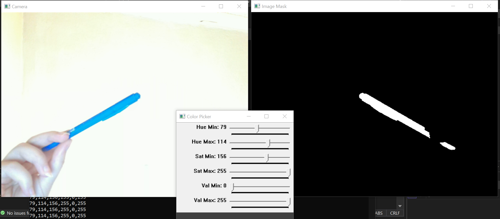
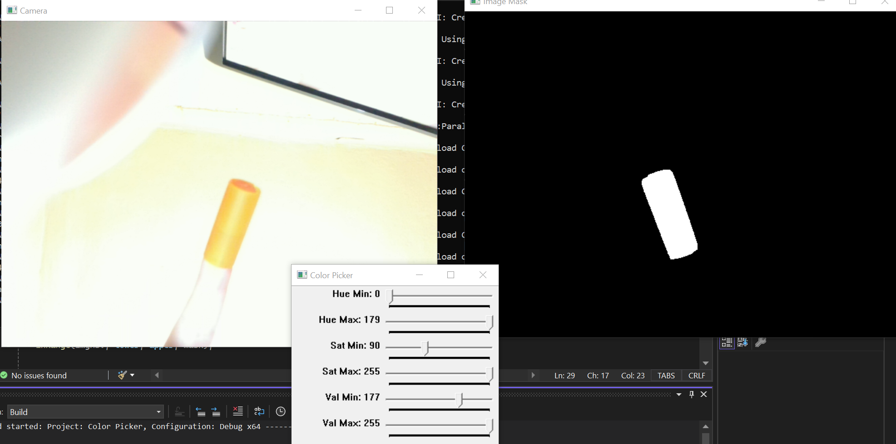

# Color Detection with OpenCV

This project utilizes OpenCV to detect specific colors in real-time video captured from a webcam. Users can adjust the HSV (Hue, Saturation, Value) parameters via trackbars to customize the color detection settings dynamically.

## Features

- **Real-Time Color Detection**: The program captures video from the webcam and applies color detection in real-time.
- **Adjustable HSV Parameters**: Users can modify the Hue, Saturation, and Value ranges using trackbars to fine-tune color detection for various lighting conditions and environments.
- **Visual Output**: The detected color regions are displayed in a mask window alongside the original camera feed.

## Requirements

- OpenCV library
- C++ compiler (e.g., g++, clang)

## Installation

1. Clone this repository:
   ```bash
   git clone https://github.com/YagmurTaze/Color-Detection.git
   cd Color-Detection

## Results




